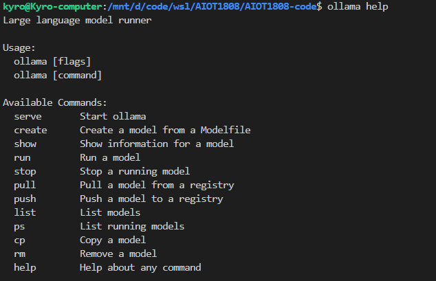
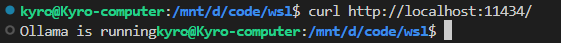
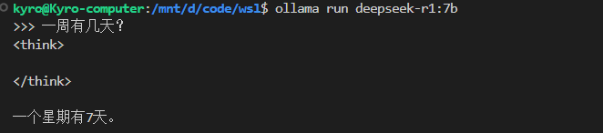
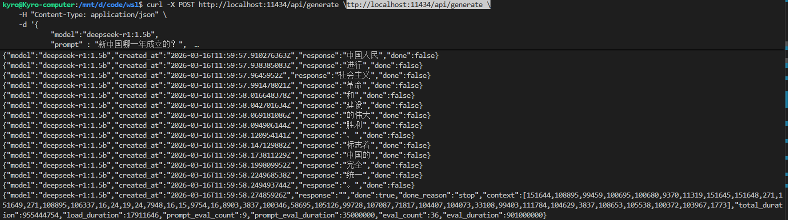
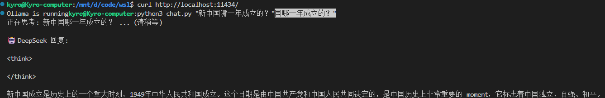

**deepseek 本都部署配置**


## deepseek 

蒸馏模型

如果你电脑运行内存为8G那可以下载1.5b，7b，8b的蒸馏后的模型

如果你电脑运行内存为16G那可以下载14b的蒸馏后的模型

我这里选择7b的模型，参数越大，使用DeepSeek的效果越好

搜索出来有很多个版本，区别就是参数不一样。

1.5b，7b，8b，14b，32b，70b，671b

### **硬件建议**

- 7B模型：至少8GB内存
- 14B模型：推荐16GB内存+GPU加速
- 量化模型（如Q4）：可降低50%显存占用


## Ollama 

Ollama 是一个轻量级的本地AI模型运行框架	https://ollama.com/

Ollama是一个“后台引擎”

ollama支持`windows`、`Linux`、`macos`平台

**使用方式分为两种**

- 终端命令行（`curl`）、或者自己写 Python、C++ 代码去直接向它的 API 发送请求。这种方式适合把 AI 接入到你自己的代码项目中。
- 下载一个第三方的图形化界面软件（比如最著名的 **Open WebUI**，或者 **Chatbox**）。这些软件连接到 Ollama 的 11434 端口后，你就可以像使用网页版 ChatGPT 一样，有漂亮的聊天对话框、历史记录保存，甚至可以上传文件。


## 部署 

### 安装ollama

将ollama解压到根目录下

```c
sudo tar -xvf ollama-linux-amd64.tgz -C /
```


验证是否安装成功

```c
# 验证安装
ollama --version
ollama help		
```




开启ollama服务

```c
ollama serve
```


### 模型下载

https://ollama.com/search

#### deepseek模型

下载deepseek模型，在ollama服务已经打开的情况下(开两个终端),也可以下载其他版本

```c
ollama pull deepseek-r1:1.5b			
ollama pull deepseek-r1:7b				
```

其他版本：切换尾椎就行

```c
版本：1.5b，适用于一般文字编辑使用（需要1.1GB空余空间）
ollama run deepseek-r1:1.5b

版本：7b，DeepSeek的第一代推理模型，性能与OpenAl-01相当，包括从基于Llama和Qwen的DeepSeekR1中提取的六个密集模型（需要4.7GB空余空间）
ollama run deepseek-r1:7b

版本：8b，（需要4.9GB空余空间）
ollama run deepseek-r1:8b

版本：14b，（需要9GB空余空间）
ollama run deepseek-r1:14b

版本：32b，（需要20GB空余空间）
ollama run deepseek-r1:32b

版本：70b，（需要43GB空余空间）
ollama run deepseek-r1:70b

版本：671b，（需要404GB空余空间）
ollama run deepseek-r1:671b
```

#### 千问模型

下载`qwen3:14b`模型

```c
ollama pull qwen3:14b
```

可以直接输入`ollama run qwen3:14b`,ollama发现本地没有该模型，会自动进行下载

```c
ollama run qwen3:14b
```

### 监听与环境变量

在使用deepseek的时候需要再前台使用

```c
ollama serve
开启服务才能使用
```

配置系统环境变量

```c
//监听所有的网络端口
echo 'export OLLAMA_HOST="0.0.0.0"' >> ~/.bashrc
echo 'export OLLAMA_ORIGINS="*" ' >> ~/.bashrc
//写入后重启服务
source ~/.bashrc
//重新开启服务
ollama serve
```

## 对话

```c
ollama serve				   # 启动基础推理服务
```

确认 Ollama 的后台程序到底有没有在正常工作：

```c
curl http://localhost:11434/
```

相当于喊了一声“喂，在吗？”，正在监听的 Ollama 听到了，赶紧通过网络回复了一句 `"Ollama is running"`




### 命令行交互

终端会变成一个类似微信的对话框（前面带个 `>>>` 提示符），它会**自动记住你之前说过的话**（也就是有上下文记忆）。

连续对话的聊天室模式

```c
ollama serve				   # 启动基础推理服务
ollama run deepseek-r1:7b		# 另开终端运行模型
/bye			//结束对话
```




### curl 方式：

底层通信通道，最原始、最直接的 **API 接口调用**。一次性的代码请求/响应，包含各种标记的 JSON 机器代码

流式输出：一边思考，一边把字打出来（打字机效果）。AI 只要生成了哪怕半个词，就会立刻通过网络把这个词发给你。

```c
curl -X POST http://localhost:11434/api/generate \
    -H "Content-Type: application/json" \
    -d '{                            
            "model":"deepseek-r1:1.5b", 
            "prompt" : "新中国哪一年成立的？", 
            "stream" : true  
    }'
```

`"model": "deepseek-r1:1.5b"` 告诉 Ollama 后台，你要唤醒并使用哪一个具体的 AI 模型。(指定大脑)

`"prompt": "hello"` (提示词/输入内容)

`"stream": true` (流式传输开关)，当为 **`false`**（关闭）时：它会在后台把整篇长篇大论全部写完，然后一次性打包发给你。



### Python 方式：

创建 `chat.py` 文件

```c
nano chat.py
```

复制粘贴代码

```c
import urllib.request
import json
import sys

def chat_with_ollama(prompt):
    url = "http://localhost:11434/api/generate"
    # 构建发给大模型的数据包
    data = {
        "model": "deepseek-r1:1.5b",
        "prompt": prompt,
        "stream": False
    }
    
    # 将数据打包为 JSON 格式并设置请求头
    req = urllib.request.Request(
        url, 
        json.dumps(data).encode('utf-8'), 
        {'Content-Type': 'application/json'}
    )
    
    try:
        # 发送请求并接收回复
        with urllib.request.urlopen(req) as response:
            result = json.loads(response.read().decode('utf-8'))
            print("\n🤖 DeepSeek 回复:\n")
            print(result.get("response", "没有获取到回复。"))
    except Exception as e:
        print(f"\n❌ 请求失败，请检查 Ollama 是否在运行。错误信息: {e}")

if __name__ == "__main__":
    # 检查是否在命令行里输入了问题
    if len(sys.argv) > 1:
        user_input = sys.argv[1]
        print(f"正在思考: {user_input} ... (请稍等)")
        chat_with_ollama(user_input)
    else:
        print("请提供一个问题！例如: python3 chat.py \"你好\"")
```

保存并退出

在 nano 编辑器中，按照以下键盘顺序操作来保存：

1. 按 `Ctrl + O` （字母 O，代表保存，会提示你文件名，直接按回车确认）
2. 按 `Enter` （回车）
3. 按 `Ctrl + X` （代表退出编辑器）

```c
python3 chat.py "新中国哪一年成立的？"
```



## 其它

### **其它指令:**

```c
# ========== 基础命令 ==========
ollama --version                    # 查看版本

# ========== 服务管理 ==========
ollama serve                        # 开启服务（必须先启动才能使用）

# ========== 模型管理 ==========
ollama list                         # 查看已下载的所有模型
ollama pull <model-name>            # 下载模型
ollama rm <model-name>              # 删除模型
ollama show <model-name>            # 查看模型信息

# ========== 运行管理 ==========
ollama ps                           # 查看运行中的模型
ollama run <model-name>             # 启动模型（进入交互模式）
ollama stop <model-name>            # 关闭模型

# ========== 交互模式内 ==========
Ctrl + D                            # 退出交互模式
/bye                                # 退出交互模式（同上）
```

**示例：**

```c
ollama pull deepseek-r1:1.5b
ollama rm deepseek-r1:1.5b
ollama rm qwen:0.5b
ollama show qwen3:14b
ollama stop qwen3:14b
```

### IP端口

`http://localhost:11434/`

**IP 地址** = **大楼的街道地址**（决定了数据要送到哪台电脑）。

**端口 (Port)** = **大楼里的房间号**（决定了数据由电脑里的哪个软件来接收）。因为你的电脑同时运行着很多程序（微信、浏览器、Ollama），必须用端口号把它们区分开。`11434` 就是 Ollama 专属的房间号。


#### 内向封闭：

`http://localhost:11434/`

本机浏览器显示`Ollama is running`

用来**自己跟自己通信**，同一局域网下的其他设备（比如你的手机、其他电脑）是绝对无法通过 `localhost` 访问你这台电脑上的 Ollama 的。

#### 外向开放型

`http://192.168.6.120:11434/`

用来**跨设备通信**的！只要在同一个 Wi-Fi 或局域网下，任何设备都可以通过这个地址找到你的电脑。

Ollama 只**监听 `localhost`（只听自己人的）。 配置了 `0.0.0.0` 之后，Ollama 不仅监听 `localhost`，同时也监听 `192.168.6.120` 这个网卡接口，允许局域网里的手机、开发板来向它请教问题。

```c
OLLAMA_HOST="0.0.0.0"
```


### 参考资料

https://ollama.cadn.net.cn/

https://www.runoob.com/ollama

https://zhuanlan.zhihu.com/p/1913901917786056107


